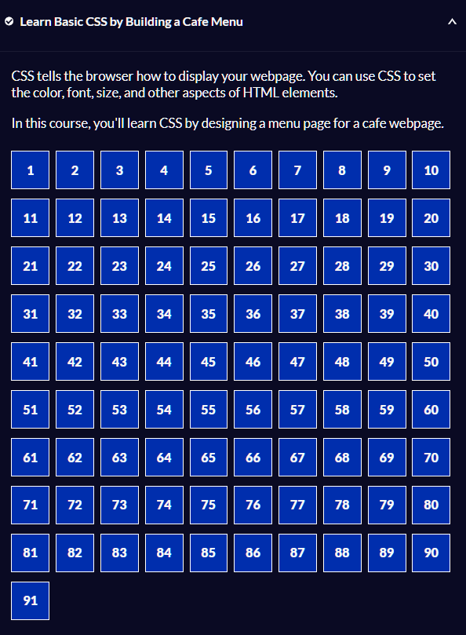

# Camper Cafe Menu

Welcome to the Camper Cafe Menu project, a sample project created as part of 
the FreeCodeCamp Responsive Web Design Professional Certification.! This project showcases a simple 
cafe menu design implemented using HTML and CSS.

## Table of Contents
1. [Introduction](#introduction)
2. [Features](#features)
3. [Technologies Used](#technologies-used)
4. [Setup and Installation](#setup-and-installation)
5. [Usage](#usage)
6. [Contributing](#contributing)
7. [License](#license)
8. [Contact](#contact)

## Introduction
The Camper Cafe Menu project displays a cafe menu featuring coffee and dessert items, along with their respective prices. It provides a visually appealing layout for showcasing menu items and their prices.

## Features
- Display of coffee and dessert items with prices
- Responsive design for various screen sizes
- Visually appealing layout with images and text

## Technologies Used
- HTML5
- CSS3

## Setup and Installation
To run this project locally, follow these steps:
1. Clone the repository: `git clone https://github.com/your-username/cafe-menu.git`
2. Navigate to the project directory: `cd cafe-menu`
3. Open `index.html` in your preferred browser.

## Usage
Once the project is open in your browser, you can:
- View the coffee and dessert items along with their prices.
- Explore the visually appealing layout designed for showcasing the menu.

## Contributing
Contributions are welcome! If you'd like to contribute to this project:
1. Fork the repository.
2. Make your changes in a separate branch.
3. Create a pull request, providing a clear description of your changes.

Please ensure your code follows best practices and doesn't introduce breaking changes.

## License
This project is licensed under the MIT License. See the [LICENSE](LICENSE) file for more details.

## Contact
If you have any questions or suggestions, feel free to contact the project 
maintainer at [Email](mailto:gagehill87@gmail.com).

---

Thank you for checking out the Camper Cafe Menu project! We hope you enjoy it.
